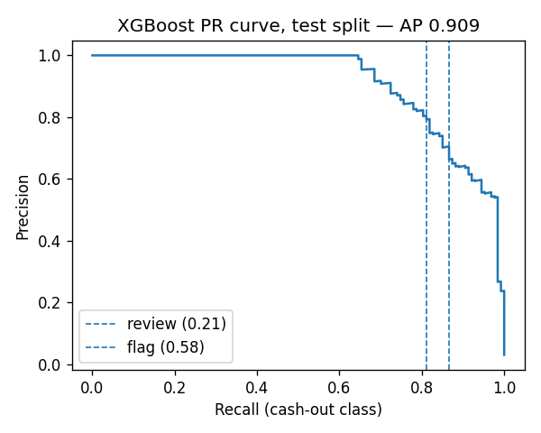
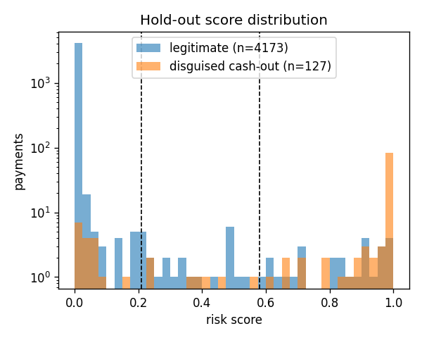
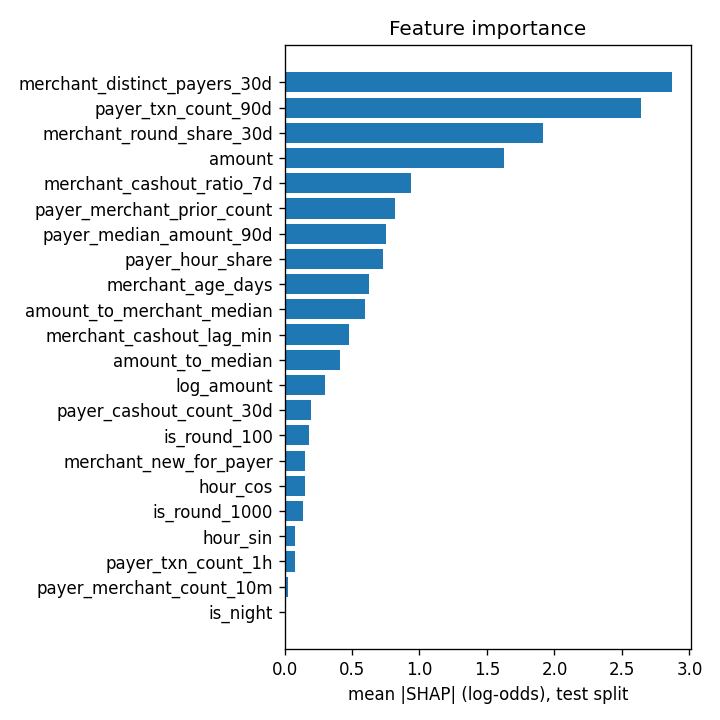

# Risk model card: disguised cash-out detection

Model version, thresholds and every number below come from `ml/artifacts/metadata.json`, `ml/reports/metrics.json` and `ml/reports/paysim.json`. Regenerate them with `npm run ml:train` and `npm run ml:paysim`; the section numbers match the plots in `ml/reports/`.

**The data is synthetic.** There is no real MFS transaction data in this project, so the models are trained and evaluated on a seeded simulation plus one independent public dataset (PaySim). The numbers validate that the pipeline, features, calibration and gates work end to end and that the signal generalises to merchants the model has never seen. They are not a claim about real-world accuracy. Section 11 says what changes with real data.

## 1. Problem and decision policy

A customer pays a "merchant" that exists only to turn wallet money into cash (a disguised cash-out), either to dodge cash-out fees and limits or to move money through a ring. The model scores every QR payment before it executes and returns a risk score in [0, 1], an anomaly score and a low-confidence flag.

The decision is taken in SQL from `app_config` thresholds (`private.decide_risk`), not by the model:

| Decision | Condition | Effect |
|---|---|---|
| ALLOW | below the review threshold and no anomaly | payment executes |
| REVIEW | risk ≥ review threshold, or anomaly ≥ 0 with enough history | the user re-enters their PIN (`STEP_UP_REQUIRED`), then pays |
| FLAG | risk ≥ flag threshold, or network score ≥ 0.8 | payment executes, an alert is raised, both wallets are flagged, both parties are notified |

If the ML service is down or slower than `ml_timeout_ms` (800 ms), SQL fallback rules decide (section 9). The model is advisory; SQL is authoritative.

## 2. Data

Generator: `ml/shongrokhon_ml/synth.py`, version 5, seed 42, deterministic. It simulates six months of payments and cash-outs for a population of customers and merchants in eight regions, with a 90-day burn-in so every feature window is full on day 1.

| Population | Count | Behaviour |
|---|---|---|
| Normal customers | 1,000 | 3–7 favourite shops, two daily peak hours, 8–35 payments a month, log-normal tickets per category |
| Cash-heavy customers | 150 | Normal spending plus 8–15 wallet cash-outs a month |
| Drifting customers | 80 | From month 4 they move to new shops, later hours and tickets up to 1.8× |
| Abusers (label 1) | 80 | Background spending plus 4–12 disguised cash-outs a month through 1–2 pseudo merchants |
| Rings (label 1) | 4 × 8 members | Coordinated sessions on 35 % of days through two dedicated merchants |
| Legit merchants | 120 | 10 categories; 25 % are "fast" shops that cash out receipts within 10–180 min |
| Pseudo merchants | 10 | Cash out 40–95 % of receipts within 3–600 min; 3 of them open only in the hold-out month |

Hard cases built into the data so the model cannot take shortcuts:

* **Held-out channels.** Three pseudo merchants and one ring only start operating in the test month. The model never sees them in training.
* **Mimicking abusers.** 15 % of abusers use in-pattern, non-round amounts at their own usual hours.
* **Abuse through legitimate shops.** 10 % of disguised cash-outs go through legit fast shops, whose cash-out habits overlap with pseudo merchants.
* **Hard negatives.** Round rent and tuition payments, occasional ৳3,000–15,000 electronics purchases, repeat payments minutes apart, and 8 % of random-shop traffic being genuine purchases at pseudo merchants (label 0).
* **No proxies for the label.** Abusers open their accounts at the same rate as everyone else, so account age carries no signal; legit shops have a heavy-tailed (Pareto) popularity, so many real shops are as small as a pseudo merchant and the number of distinct customers is not a shortcut. Both were found and removed while hardening v5: the first model flagged a brand-new customer paying a small legit shop, and SHAP pointed at exactly those two features.

**Label.** 1 for every payment an abuser or ring member makes to a pseudo, ring or (when routed there) legit fast merchant as a disguised cash-out; 0 otherwise, including cover traffic to pseudo merchants.

**Split** (`dataset.py`): a user is hashed into train / validation / test (70 / 15 / 15), and the six months are cut into months 1–4 / 5 / 6. A row counts only where both agree, so the test split is **unseen users in an unseen month**, with some unseen merchants.

| Split | Rows | Positives |
|---|---|---|
| Train (months 1–4, 70 % of users) | 77,140 | 1,818 (2.4 %) |
| Validation (month 5, 15 % of users) | 4,442 | 71 (1.6 %) |
| Test (month 6, 15 % of users) | 4,300 | 127 (3.0 %), 29 of them to merchants absent from training; 50 test merchants are unseen in training |

## 3. Features

22 features, computed per payment from history strictly before the payment (`features.py`), with an identical SQL implementation (`private.risk_features`) checked by a generated parity test (`supabase/tests/05_feature_parity.test.sql`). Hours are Dhaka local time; windows are half-open.

| Group | Feature | Definition |
|---|---|---|
| Amount and time | `amount` | BDT amount |
| | `log_amount` | log1p(amount) |
| | `is_round_100`, `is_round_1000` | amount is a multiple of ৳100 / ৳1,000 |
| | `hour_sin`, `hour_cos` | cyclic encoding of the hour |
| | `is_night` | hour < 5 |
| Payer behaviour | `payer_txn_count_90d` | payer's payments in 90 days |
| | `payer_median_amount_90d` | median of those amounts |
| | `amount_to_median` | amount ÷ payer median |
| | `payer_hour_share` | share of the payer's payments within ±1 h of this hour |
| | `payer_cashout_count_30d` | payer's own cash-outs in 30 days |
| | `payer_txn_count_1h` | payer's payments in the last hour |
| Payer × merchant | `payer_merchant_prior_count` | prior payments to this merchant in 90 days |
| | `amount_to_merchant_median` | amount ÷ the payer's median at this merchant |
| | `merchant_new_for_payer` | 1 if no prior payment |
| | `payer_merchant_count_10m` | payments to this merchant in 10 minutes |
| Merchant | `merchant_distinct_payers_30d` | distinct payers in 30 days |
| | `merchant_round_share_30d` | share of receipts that are multiples of ৳1,000 |
| | `merchant_cashout_ratio_7d` | cash-outs ÷ receipts over 7 days (capped at 5) |
| | `merchant_cashout_lag_min` | median minutes from a receipt to the next cash-out, 30 days (capped at 1,440) |
| | `merchant_age_days` | days since first receipt (capped at 365) |

The Isolation Forest uses four user-relative features: log(amount ÷ the payer's usual ticket at this merchant), `payer_hour_share`, `payer_txn_count_1h`, `payer_merchant_count_10m`. A payer with fewer than 5 payments in 90 days is **low confidence**: the risk score still applies, but an anomaly alone never causes a step-up.

## 4. Models and calibration

| | XGBoost classifier (risk score) | Isolation Forest (anomaly score) |
|---|---|---|
| Library | xgboost 2.1 | scikit-learn 1.6 |
| Settings | 600 trees, depth 6, learning rate 0.05, subsample 0.9, colsample 0.9, min_child_weight 4, `aucpr`, `scale_pos_weight` = negatives ÷ positives (chosen on the validation split; the v4 model used 300 / depth 5 / 0.08) | 200 trees, 1,024 samples per tree, contamination 0.01 |
| Trained on | train split, all rows | train split, label 0, established normal / cash-heavy / drifting users |
| Output | P(disguised cash-out) | −decision_function; ≥ 0 means outside the learned baseline |

**Thresholds are calibrated, not chosen.** On the validation split, the FLAG threshold is the score that reaches the best recall with a false-positive rate ≤ 0.3 %, and the REVIEW threshold the same at ≤ 0.8 % (searched below FLAG). The contamination of the Isolation Forest was picked from a sweep (section 5). The values are written to `metadata.json`, mirrored as `app_config` defaults, and a test (`ml/tests/test_thresholds_in_sync.py`) fails when they diverge.

| Operating point | Value (model `p2-01b6a9ed`) | Target on validation | Measured on test |
|---|---|---|---|
| REVIEW | risk ≥ 0.21 | FPR ≤ 0.5 % | recall 86.6 %, FPR 1.17 % |
| FLAG | risk ≥ 0.58 | FPR ≤ 0.3 % | recall 81.1 %, FPR 0.65 % |
| Anomaly | score ≥ 0 | contamination 1 % | 1.2 % of in-pattern validation rows |

The REVIEW target is set below the 1 % product limit on purpose: the hold-out month runs about 0.3–0.7 points above validation because of its unseen merchants, and the REVIEW gate that matters to customers (99 % of ordinary payments at ordinary shops stay below it, section 5) must hold on the hold-out month, not on validation.

Generator v4 (the previous submission) produced a model with PR-AUC 1.000 and zero false positives, because every positive went to a merchant with an unmistakable cash-out profile that the model had already seen in training. The v4 thresholds (0.25 / 0.5) were the midpoints of an empty score gap. Generator v5 removed those shortcuts (section 2), so the thresholds now sit on a real precision–recall trade-off.

The model version is a hash of the generator version, population config, feature list and hyper-parameters, so any change to the pipeline produces a new version; `/explain` refuses to explain a score produced by a different version.

## 5. Measured performance (hold-out split)

Test split: 4,300 payments by users the model never saw, in a month it never saw, 127 of them disguised cash-outs, 29 of those to merchants absent from training. Confidence intervals are 95 % percentile intervals over 1,000 bootstrap resamples of the test rows.

### 5.1 XGBoost risk score

| Metric | v5 (this submission) | 95 % CI | Gate | v4 (previous) |
|---|---|---|---|---|
| PR-AUC (average precision) | **0.909** | 0.867 – 0.940 | ≥ 0.90 | 1.000 |
| Recall at FLAG | **0.811** | 0.739 – 0.873 | ≥ 0.80 | 1.000 |
| Recall at REVIEW or FLAG (system catch rate) | **0.866** | | ≥ 0.85 | 1.000 |
| False-positive rate at FLAG | **0.65 %** | 0.40 – 0.90 % | ≤ 1 % | 0.00 % |
| Precision at FLAG | 0.792 | | | 1.000 |
| False-positive rate at REVIEW | 1.17 % | | | 0.00 % |
| Normal → legit payments below REVIEW | 99.05 % | | ≥ 99 % | 100 % |
| Abuser → pseudo-merchant payments at FLAG, merchant seen in training | 93.7 % | | ≥ 85 % | 100 % |
| Abuser → pseudo-merchant payments at FLAG, merchant **unseen** in training | 31.8 % | | reported | n/a |
| Recall at FLAG on all positives to **unseen merchants** (29) | 0.48 | | reported | n/a |

Confusion matrix at FLAG: 103 true positives, 24 false negatives, 27 false positives, 4,146 true negatives.

 

**Where the misses are.** On channels the model has seen, recall is 94–96 % for both plain and mimicking abusers and 100 % for rings. The misses concentrate in two buckets that are hard by construction: abuse routed through legitimate fast-cash-out shops (40 % at FLAG, 60 % at REVIEW) and pseudo merchants that opened in the test month with slow, partial cash-out habits that overlap with real shops. The second bucket is the real-world case of a brand-new mule merchant, and it is the number to watch when real data arrives; the ring job (section 8) and analyst labels (section 11) are the intended answers to it. The v4 gates (recall ≥ 0.85 at FLAG) were set when every test merchant was also in training; for v5 the FLAG gate is 0.80 and a gate on the system catch rate (FLAG or step-up) was added at 0.85, both documented in `docs/phase2-test-matrix.md`.

### 5.2 What the model relies on (ablation and SHAP)

Retraining without one feature group at a time, same hyper-parameters, same FLAG target:

| Features | PR-AUC | Recall at FLAG | Reading |
|---|---|---|---|
| All 22 | 0.909 | 0.72 | (recall here is at a FLAG point re-calibrated per ablation, so it is lower than the production figure) |
| Without merchant features | 0.696 | 0.43 | The merchant's cash-out behaviour is the core signal |
| Without payer-behaviour features | 0.813 | 0.63 | The payer's own history is the second pillar |
| Without payer × merchant features | 0.854 | 0.64 | Whether the payer has used this shop before matters |
| Without amount and time features | 0.892 | 0.72 | |
| Merchant features only | 0.600 | 0.40 | No single group is enough: the model needs the interaction |
| Payer behaviour only | 0.413 | 0.14 | |
| Amount and time only | 0.239 | 0.07 | Round amounts and night hours are weak on their own, as they should be |

Mean |SHAP| on the test split (`ml/reports/feature_importance.png`): `merchant_distinct_payers_30d` 2.87, `payer_txn_count_90d` 2.64, `merchant_round_share_30d` 1.92, `amount` 1.63, `merchant_cashout_ratio_7d` 0.94, `payer_merchant_prior_count` 0.82, `payer_median_amount_90d` 0.75, `payer_hour_share` 0.73, `merchant_age_days` 0.62. The `is_night` and velocity features carry almost nothing for the XGBoost model; they are the Isolation Forest's job. The top two features are interactions, not proxies: a merchant with few distinct customers is suspicious only when they pay round amounts that get cashed out, and a payer with little history is suspicious only at such a merchant (section 2, "no proxies").

### 5.3 Calibration

`ml/reports/calibration.png` plots observed cash-out rate against mean predicted risk in ten bins. Scores are usable as probabilities in the low and high bins, where almost all payments sit; the middle bins hold a few dozen payments each and are noisy.

### 5.4 Fairness (TC-P2-XGB-11)

False-positive rate among legitimate customers by region and by segment, gated on the Wilson 95 % lower bound against 3× the overall FPR (floor 1 %):

| Group | FP / negatives | FPR |
|---|---|---|
| Khulna | 9 / 481 | 1.87 % |
| Sylhet | 7 / 505 | 1.39 % |
| Mymensingh | 2 / 354 | 0.56 % |
| Barishal | 2 / 682 | 0.29 % |
| Rangpur | 2 / 699 | 0.29 % |
| Chattogram | 1 / 461 | 0.22 % |
| Rajshahi | 1 / 448 | 0.22 % |
| Dhaka | 0 / 415 | 0 % |
| Normal | 17 / 3,274 | 0.52 % |
| Drifting | 7 / 471 | 1.49 % |
| Cash-heavy | 0 / 300 | 0 % |

No group's Wilson lower bound exceeds the 1.9 % limit (3 × the overall FPR). Regions are assigned at random in the simulation, so the Khulna and Sylhet figures are what nine and seven false positives look like by chance at this sample size; with real data this table is where a real disparity would show first. Drifting users are the most exposed segment, which is expected: their new merchants and bigger tickets look like the start of abuse until history accumulates.

### 5.5 Isolation Forest (TC-P2-IF-02..08)

Scenarios built for 60 established test users on a day in the hold-out month:

| Scenario | Result | Gate |
|---|---|---|
| Usual merchant, amount and hour: not flagged | 60 / 60 | ≥ 95 % |
| 10× the usual ticket: flagged | 60 / 60 | ≥ 95 % |
| Never-seen 3 AM payment raises the score | 59 / 60 | ≥ 90 % |
| 5 payments in 9 minutes to a new merchant: flagged | 60 / 60 | ≥ 95 % |
| Drifting users in month 6 (2,038 payments), alert rate before / after a rolling 90-day retrain | 3.0 % / 2.4 % (lower 95 % bound 1.8 %) | lower bound ≤ 2 % |
| Contamination sweep 0.01–0.05: validation alert rate | 1.2 / 2.4 / 3.5 / 5.0 / 6.1 % with 100 % spike detection at each | chose 0.01 |

Live, the seeded U-NORMAL paying ৳4,200 at its usual shop (10× its ticket) returns `STEP_UP_REQUIRED`, and the seeded U-ABUSER paying M-PSEUDO ৳10,000 is flagged (TC-P2-FLOW-02/03).

## 6. External validation on PaySim

To check that the pipeline learns something that is not an artefact of our own generator, `npm run ml:paysim` retrains it on **PaySim** (Lopez-Rojas, Elmir and Axelsson, 2016; Kaggle `ealaxi/paysim1`), a public simulation of one month of mobile-money transactions calibrated on an African operator's logs: 6.36 M transactions, 8,213 frauds (0.13 %), each a TRANSFER into a mule account followed by a CASH_OUT from it.

What is reused unchanged: the event schema, all 22 features (`features.py`), the XGBoost hyper-parameters (`train.fit_xgb`) and the threshold calibration at the same target false-positive rates (`train.calibrate`). PaySim rows are mapped as PAYMENT/TRANSFER → payment events labelled with `isFraud`, CASH_OUT → cash-out events by the account that cashed out. Every fraudulent transfer plus 40,000 legitimate payments and 40,000 legitimate transfers are scored; the split is by time (steps < 500 train, < 620 validation, the rest test). Results are written to `ml/reports/paysim.json` and `ml/reports/paysim_pr_curve.png`.

<!-- PAYSIM:RESULTS -->
*Results pending: the CSV (about 470 MB) must be downloaded from Kaggle into `ml/data/paysim/` (gitignored) and `npm run ml:paysim` run once. The script prints PR-AUC, recall and FPR at the calibrated FLAG point, the confusion matrix, feature gain and the recall of PaySim's own built-in rule (`isFlaggedFraud`) for comparison.*

Caveats: PaySim customers appear once each, so the payer-behaviour features sit at their cold-start values and only amount, time and payee-side features carry signal; one month truncates the 30/90-day windows; PaySim's fraud is "drain the account into a mule", not the disguised cash-out at a pseudo-merchant our generator models; the balance columns are not used because PaySim cancels detected frauds, which would leak the label. It is still synthetic data, but independent synthetic data.

## 7. Explainability

The service exposes `/explain`, which returns exact TreeSHAP contributions in log-odds for one payment using XGBoost's own `pred_contribs` (no extra library; `base_value + Σ contributions = margin`, checked by `ml/tests/test_explain.py`). The investigation assistant (`supabase/functions/investigate/`) keeps the six strongest drivers, labels them in plain language ("Share of this merchant's receipts cashed out in the last 7 days") and lets the LLM describe them only through placeholders, so the analyst sees the model's actual reasons. Section 5 gives the global picture (mean |SHAP| per feature on the hold-out split).

## 8. Ring detection

`ml/shongrokhon_ml/network.py` runs hourly over a 30-day window:

1. Each merchant with ≥ 10 receipts in the window gets a suspicion score: 0.35 × cash-out ratio + 0.35 × share of ৳500-round receipts + 0.3 × share of receipts mirrored by an 80–100 % cash-out within 60 minutes. Suspicious if the ratio ≥ 0.55 and the larger of the two shares ≥ 0.3. (The receipt minimum stops a brand-new shop with six payments from being called a mule.)
2. A bipartite payer–merchant graph is built over suspicious merchants, keeping payers with ≥ 2 such payments.
3. Connected components with ≥ 5 payers are kept whole up to 12 payers, otherwise split with Louvain. A group is a ring if ≥ 50 % of its flow is round **and** ≥ 50 % of its payments fall within 30 minutes of a payment by another member (coordinated sessions). Unrelated abusers who merely share a busy pseudo merchant fail the second test; real rings score 0.98–1.0 on it.
4. Ring merchants get a network score of 0.8 + 0.2 × suspicion, which forces FLAG on live payments (`network_flag_threshold` 0.8). Every synthetic ring, including the held-out one, is found as one group with no ordinary customers in it (`ml/tests/test_network.py`); the seeded RING-01 is found live (TC-P2-FLOW-08).

## 9. Resilience

* **ML down or slow:** `private.fallback_risk` decides from SQL features: FLAG on network score ≥ 0.8, REVIEW on amount ≥ ৳10,000 or ≥ 3 payments to the same merchant in 10 minutes, else ALLOW. Scores record `source = 'FALLBACK'`.
* **Cash-out and send-money flows** are scored by SQL rules only (`flow_score`, `source = 'RULES'`): FLAG if the payee wallet is flagged, REVIEW on amount or burst.
* **Score freshness:** a score is valid for `risk_score_ttl_seconds` (300 s) and is bound to the exact payment; `make_payment` refuses without it.
* **Decision authority:** thresholds live in `app_config`, so operations can tighten or loosen without a deploy, and the model's own advisory decision is ignored.

## 10. Serving

FastAPI, 4 workers, numpy-only scoring path with a vectorised Isolation Forest whose equality with scikit-learn is tested (`ml/tests/test_iforest.py`).

| Measurement | Result | Budget |
|---|---|---|
| MLAPI-05: 1,000 sequential `/score` calls | p50 5.5 ms, p95 10.5 ms | 200 ms |
| MLAPI-06: 100 users at ~1 request/s for 5 min (29,464 requests) | p95 35 ms, 0 errors | 200 ms |
| MLAPI-06 at saturation (no think time) | 342 req/s, p95 921 ms | re-run on production hardware |
| PERF-01: 1,000 sequential end-to-end payments | p50 95 ms, p95 114 ms | 1,500 ms |
| PERF-02: 50 concurrent users for 180 s (5,872 payments) | p95 3.2 s on a laptop stack, 0 ledger mismatches | 1,500 ms, open item |

## 11. Limitations and what real data changes

* **Synthetic labels.** Abuse is simulated from the product spec. Real abuse will be rarer, noisier and adversarial; expect lower precision at the same recall and recalibrate both thresholds on real validation data before trusting them.
* **Analyst feedback is not yet in the loop.** Analysts' confirmed / false-positive decisions land in `public.training_labels` with the exact scored features, and `labels.py` exports them, but `train.py` does not read them yet. The first production retrain should append them to the training data.
* **Fairness** is measured by region and segment on synthetic users, who have no protected attributes. With real data, add the operator's own fairness dimensions.
* **One model per deployment.** There is no per-region or per-merchant-category model; the features carry that context instead.
* **Drift.** The Isolation Forest baseline must be retrained on a rolling window (section 5, IF-07); the XGBoost model should be retrained when the analyst labels show a rising false-positive rate.
